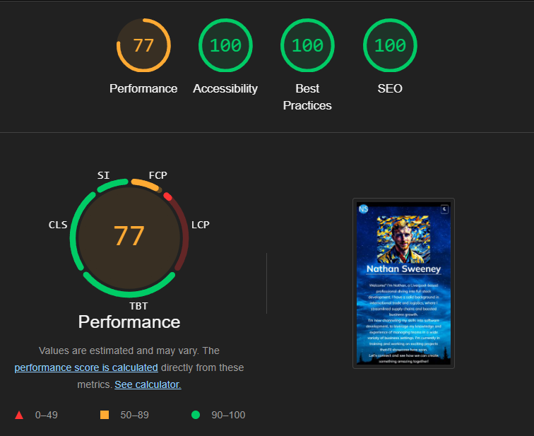

# Nathan Sweeney's Portfolio

## Overview

Welcome to Nathan Sweeney's portfolio website. This project showcases Nathan's journey from international trade to full stack development. It highlights his skills, projects, and professional accomplishments. The website aims to provide a comprehensive view of Nathan's expertise to potential employers, collaborators, and clients. It serves as a platform for present projects, demonstrate skills in web development, and offer a point of contact for professional inquiries.

## Features

- **Responsive Design**: Ensures a seamless experience across all devices, making the website accessible on desktops, tablets, and mobile phones.

- **Light/Dark Mode Toggle**: Users can switch between light and dark modes for different viewing experiences. 

- **Homepage**: Features a brief bio and an AI-generated portrait of Nathan Sweeney, providing a personal touch and professional summary. 

- **Portfolio Section**: Displays current and upcoming projects with detailed descriptions, images, and links, showcasing work and skills. Each project item includes a title, image, description, and links to view the project or source code. 
- **Contact Form**: A functional contact form allows users to reach out directly for inquiries or collaboration opportunities. The form includes fields for name, email, and message, ensuring that users can provide detailed inquiries. The form uses HTML5 validation to ensure required fields are filled out correctly before submission. 

- **Footer with Social Media Links**: Contains links to Nathan's LinkedIn and GitHub profiles, which open in new tabs, making it easy for visitors to connect with him on social media. 

## Testing

## Testing

The website has been thoroughly tested to ensure that all features work as intended and that it provides a straightforward and effective user experience.

- **Cross-Browser Testing**: The site was tested on Chrome, Firefox, Safari, and Edge to ensure compatibility and consistent performance.
- **Responsive Design Testing**: The site's layout and design were tested on various screen sizes, including desktops, tablets, and mobile phones, to ensure a seamless experience across devices.
- **Form Functionality**: The contact form was tested to ensure that it correctly sends messages and handles user input validation.
- **Lighthouse Testing**: Lighthouse tests were conducted for both desktop and mobile versions of the site.
  - **Desktop Results**: The results for desktop showed excellent performance across all metrics. 
  - **Mobile Results**: The mobile test results indicated good performance overall, with some areas for future improvement in terms of performance. 

### Interesting Bugs or Problems

- During testing, a minor issue was discovered with the dark mode toggle not maintaining the selected mode on page reload. This will be addressed in a future update when incorporating JavaScript for a better solution.
- During deployment, it was discovered that the file paths from my HTML files were incorrect and had to be fixed.

### Validator Testing

- **HTML**
  - No errors were returned when passing through the official [W3C validator](https://validator.w3.org/nu/).
- **CSS**
  - No errors were found when passing through the official [(Jigsaw) validator](https://jigsaw.w3.org/css-validator/).

## Deployment

The site was deployed to GitHub Pages. The steps to deploy are as follows:

1. In the GitHub repository, navigate to the Settings tab.
2. From the source section drop-down menu, select the Master Branch.
3. Once the master branch has been selected, the page will be automatically refreshed with a detailed ribbon display to indicate the successful deployment.

The live link can be found here - [Nathan Sweeney's Portfolio](https://n3wee.github.io/project-portfolio-website/)

## Credits

### Content

- All written content was created by Nathan Sweeney.

### Media

- Background images used from https://unsplash.com/
- Van Gogh style portrait generated with AI using a photo of myself, https://www.lightxeditor.com/
- Favicon was generated from https://favicon.io/favicon-generator/
- Images of coding logos used in my upcoming portfolio previews were saved from Wikipedia entries.

### Code

- The base code structure and some design elements were created from the resources of Code Institute along with ChatGPT 4.0.
- The toggle solution for background image without using JavaScript was suggested by ChatGPT 4.0.

---

© 2024 Nathan Sweeney. All rights reserved.
